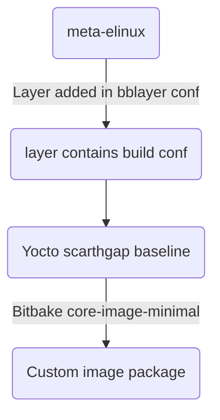

# Meta-elinux layer for Raspberry pi

The meta layer for Raspberry pi (scarthgap) yocto build.
have the custom core-image-minimal package to boot the rpi3-b+ board.

This meta-layer contains the following things.

 - Custom Build script it has many things like select machine, set number of cpu to be used for yocto build, mirror build support added.

## Dependencies

This layer requires the following layers:
- meta (from poky)
- meta-poky (from poky) 
- meta-yocto-bsp (from poky)
- meta-oe (from meta-openembedded)
- meta-python (from meta-openembedded)
- meta-networking (from meta-openembedded)
- meta-raspberrypi
- meta-lts-mixins

## Usage

### Quick Start
1. Clone the required layers (poky, meta-openembedded, meta-raspberrypi, meta-lts-mixins)
2. Source the build script:
   ```bash
   source scripts/build.sh --fresh
   ```
3. Follow the interactive prompts to configure your build
4. Build the image:
   ```bash
   bitbake core-image-minimal
   ```

### Build Options
- `--fresh`: Fresh build without using mirrors
- `--build`: Build using mirrors and cached downloads

### Supported Machines
- raspberrypi4
- raspberrypi5
- raspberrypi4-64
- raspberrypi3-64

### Configuration
The layer provides:
- Custom core-image-minimal with development packages
- WiFi configuration with base64 encrypted passwords
- Python3 development environment
- GPIO and hardware tools (i2c-tools, spitools, raspi-gpio)
- Network utilities and debugging tools

### Meta-layer flow chart:

