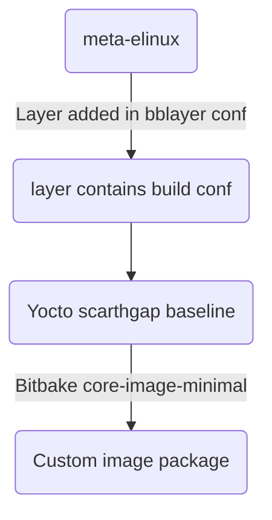

# Meta-elinux layer for Raspberry pi

The meta layer for Raspberry pi (scarthgap) yocto build.
have the custom core-image-minimal package to boot the rpi3-b+ board.

This meta-layer contains the following things.

 - Custom Build script it has many things like select machine, set number of cpu to be used for yocto build, mirror build support added. 

### Meta-layer flow chart:

